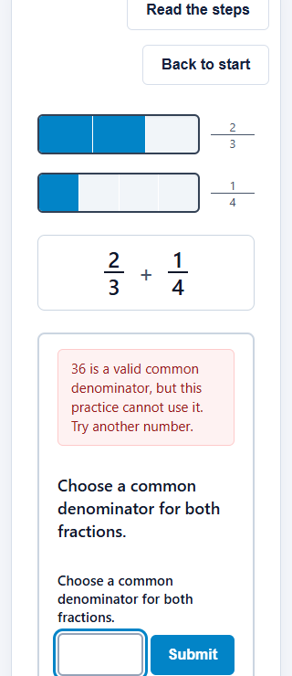
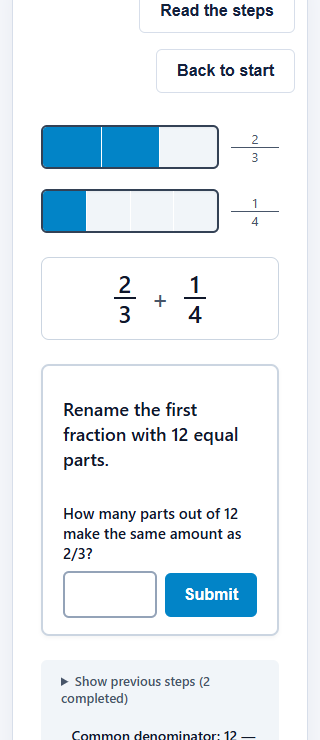
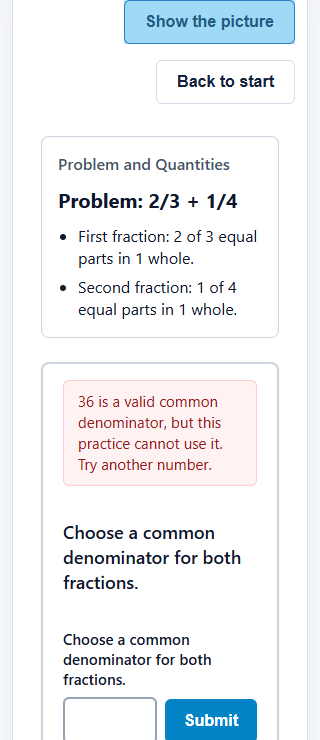
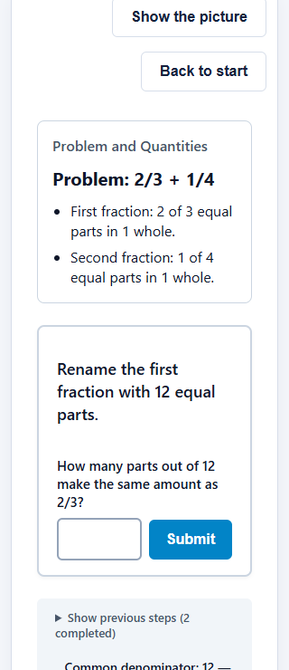

# Plan 22 — Denominator Path Closure Repair Progress

**Date:** 2026-10-07

**Implementation commit:** `53b95c9` (`fix: close unsupported denominator paths in phase 2`)

**Mechanism gate:** approved in [`mechanism-review.md`](./mechanism-review.md), commit `df7a2ec`.

## Result

Fresh Phase 2 episode definitions use revision 2. Before a mathematically valid common-denominator proposal is established, the reducer now checks representation eligibility, reviewed authored coverage, and the selected condition's reflection data. An unavailable path remains at `decide` with local recovery. The response is still classified as mathematically valid, and the learner can try an authored denominator. Revision 1 definitions remain registered for historical replay and retain their original transition behavior.

The recovery copy is: “36 is a valid common denominator, but this practice cannot use it. Try another number.” Both visual and linear renderers keep the decide input available and focus it when its view is visible.

## Reproduction and closure evidence

The pre-change pure reducer probe for `2/3 + 1/4` reached `reflect/active` after a proposed denominator of 36 under both registered conditions. The proposal was mathematically valid (`valid-non-least`), but rendering was ineligible and authored coverage was outside the reviewed set. The matching condition had no matching choices for 36. The premise condition had no authored premise case, while its yes/no controls were still present. Thus the old route could expose a reflection step without the content needed to complete it.

Mounted-browser reproduction showed the same distinction: matching reached reflection with no active response control; premise reached reflection with two yes/no controls and no authored premise. The reducer now closes the path before reflection or any unsupported transform can be established.

The pure path-closure checks and mounted routes cover these outcomes:

- **12 and 24:** canonical and authored alternate paths remain available for both conditions. Matching has authored choices at both denominators. Premise has authored cases at 12 (false premise) and 24 (true premise), preserving meaningful yes/no responses.
- **36:** mathematically valid, classified as non-least, outside fraction-bar limits, and outside authored coverage. It stays in `decide`; no common denominator is established and no unsupported bar or reflection step mounts.
- **Eligible but unauthored 24:** the nested fixture's denominator 24 is representation-eligible but outside authored coverage. It is rejected at the task boundary and the fixture is not added to the live practice registry.
- **Missing condition data:** an otherwise authored path with no fixture-bound reflection data is rejected for both matching and premise conditions.
- **No reflection beat:** closure does not require reflection data for a registered definition that has no reflection beat.

The coverage check is derived from the validated path, registered episode definition, and active condition. It does not impose a global 12/24 denominator list or infer an unbounded set of authored prompts.

## Learner routes and narrow view

The route matrix adds three Plan 22 rows. The visual matching route submits 36 by keyboard, verifies the recovery copy, retained input and focus, and absence of transform controls and a 36-part bar, then submits 12 and reaches conversion. The premise route uses the reduced-motion linear view at 320px, verifies the same boundary through the linear input, and recovers with 12. The retry/return route checks clean retry state and focus restoration to the entry title.

A separate Edge browser session with `hasTouch: true` and a 320×740 viewport used tap gestures through the matching route. At the 36 boundary, `document.documentElement.scrollWidth` was 320, the recovery text was visible, the decide input was focused, and the transform input was absent. The decide input measured approximately 93.94×47px at x=63, y=693.22; its bottom was about 0.22px beyond the initial 740px viewport edge. After entering and tapping 12, the learner reached “Rename the first fraction with 12 equal parts.” This records the small initial viewport-edge overrun explicitly; it does not establish that every control initially fits on screen. This was browser touch emulation, not a physical-device test. Assistive-technology behavior was not tested.

## Failing-first and legacy replay

**Correction from Delivery Review Repair 01:** the earlier `tests/interaction-episode.test.js` assertion routed through revision 1 and was not an admission-guard removal seed for a fresh revision-2 learner launch. It remains only as a legacy compatibility witness; the earlier description of it as the required admission-removal seed was incorrect.

The replacement browser sensitivity verifier is `scripts/dev/plan22-delivery-evidence.cjs`. It requires exactly one source guard to match, changes only that revision-2 condition to `false`, rebuilds the app, and runs the existing matching and premise Plan 22 browser routes against the mutated build. With the guard disabled, both routes fail at their expected recovery-copy assertion: matching waits for `.app-visual-view .recovery-feedback`, and premise waits for `.app-linear-view .recovery-feedback`. Each filtered run reports exactly one failed route; dependent controls pass. The verifier then restores `src/interaction/episode.js` byte-for-byte and checks its SHA-256 (`95bfa0db3f020bea07d6ddc60f2c8b5672f0f832a3d7aa6c863df11c074a60f0` before and after), rebuilds cleanly, and requires both filtered routes to pass. The recorded seed failures and clean passes are in [`guard-seed-and-rendered-measurements.json`](./evidence/guard-seed-and-rendered-measurements.json).

Before Plan 22 source edits, six revision-1 replay envelopes and their complete replayed states were captured from commit `df7a2ec`: matching and premise at 12, 24, and 36. `tests/interaction-provenance-replay.test.js` replays each envelope and compares the full state with `toEqual`; all six exact comparisons pass. A separate reducer test confirms a new explicit revision-1 episode still transitions to 36 as before. This is bounded evidence for these six fixtures, not a claim covering every possible historical envelope.

## Delivery review screenshots and measurements

The following screenshots were captured from a restored clean production build in Microsoft Edge through Playwright touch emulation. Both scenarios use a 320×740 CSS-pixel viewport and medium support. The matching route uses standard motion; the premise route uses reduced motion and the linear view.

| Scenario | At denominator 36 boundary | After recovery with 12 |
|---|---|---|
| Matching, visual, standard motion |  |  |
| Premise, linear, reduced motion |  |  |

The measurements include viewport and document dimensions, scroll offsets, feedback/input/submit bounds in viewport and document coordinates, viewport intersections, active focus, recovery role/copy, and horizontal-overflow state. Both scenarios had `clientWidth=320`, `scrollWidth=320`, and no horizontal overflow; both documents were vertically scrollable. At the visual matching boundary, the focused input bounds were x=63, y=693.22, width=93.94, height=47; its bottom was 0.22px beyond the initial viewport edge. In the reduced-motion linear premise boundary, after switching views the input bounds were x=63, y=697.13, width=93.94, height=47, and submit bounds were x=164.94, y=698.63, width=92.06, height=44; their bottoms were 4.13px and 2.63px beyond the viewport edge. The full document remained vertically scrollable, and the touch-emulated 12 submission succeeded. These captures do not claim that every control initially fits on screen, and they are not physical-device or assistive-technology results.

## Validation performed

- `npm test -- --run` — **25 files passed; 292 tests passed**.
- `npm run build` — production app and subtraction prototype bundles built successfully.
- `npm run test:routes` — **46 browser executions passed across 44 route rows**.
- `node scripts/dev/plan-status.js lint` — **OK; no violations**. Packet remains `in-progress`; no packet status or owner disposition was changed.
- `git diff --check` and `git diff --cached --check` — no whitespace errors.
- Delivery Review Repair 01 verifier — both guard-disabled browser witnesses failed at their recovery-feedback assertions; the source was byte-for-byte restored; the clean build and both browser witnesses passed; four screenshots and measurements were captured.

## Advisor consultation disposition

- **Branch:** A — required because this change has a behavioral surface.
- **Requested model:** `gpt-6.1-sol`, medium effort.
- **Observed model:** `gpt-6.1-sol`, as stated by the advisor in its response.
- **Artifact:** the actual core closure implementation, revision gate, reducer behavior, copy/focus behavior, and test evidence were included inline in the consultation brief.
- **Posture:** instruction-read-only with post-hoc verification. Structural read-only was not independently available. The primary remained the only writer; the advisor was depth 1 and was instructed not to inspect files, use tools, write, or spawn children.
- **Post-consultation check:** `git status --short`, `git diff --stat`, and `git diff --check` were compared with the pre-consultation worktree; no files changed. The temporary touch-check script was absent.
- **Coarse cost:** one advisor response turn, roughly one minute of additional review time.

Findings and disposition:

1. **Reflection record shape might be under-validated** (advisor question, P2). The advisor noted that the closure predicate itself checks basic presence and denominator alignment, rather than revalidating every fraction field or uniqueness property. **Independent verification:** the actual provider modules are fixed fixture-keyed maps; 12/24 matching records each contain three distinct IDs and fraction forms, and premise records contain the required source/presented forms and fixture identity. Missing fixture/denominator lookups return `null`. **Disposition:** reject as a defect in this bounded repair; the current authored records satisfy the consumed contract, and a broader content-schema redesign is outside Plan 22. No code change.
2. **Reflection lookups might throw before the unsupported-path reason is returned** (advisor question, P2). **Independent verification:** `reflectionChoicesForInstance` and `premiseCheckForInstance` perform optional fixture-keyed map lookup and return `null` for absent records; they do not parse or compute from the denominator. Valid common-denominator classifications provide a target denominator, and the 36 and missing-data paths were exercised. **Disposition:** reject as an observed defect; the concern is not reproduced with the current providers. No code change.
3. **Hidden-state focus and assistive announcement coverage might be incomplete** (advisor question, P2). **Independent verification:** both recovery nodes use `role="alert"`; both renderers check hidden ancestors before moving focus, and browser routes verify keyboard focus and switching to the linear view. **Disposition:** accept as a coverage limitation: no physical-device or assistive-technology announcement test was run, and the hidden-ancestor check is specific to the app's current hidden-view behavior. No code change; this limitation is recorded above.

## Authority and remaining gate

Implementation and evidence are committed in `53b95c9`. The packet remains `in-progress`. Owner review of the rendered behavior and any technical acceptance remain separate. Plan 22 does not authorize deployment or public release; those gates remain pending.
